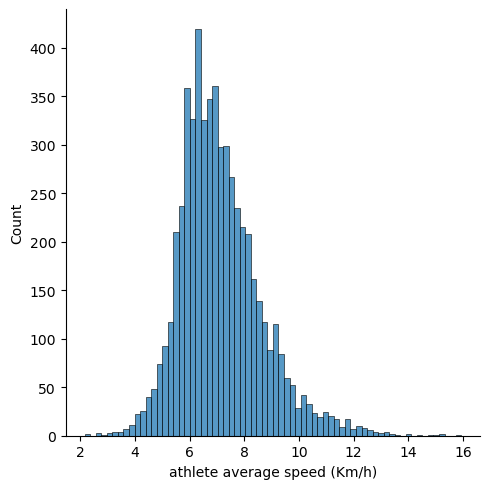
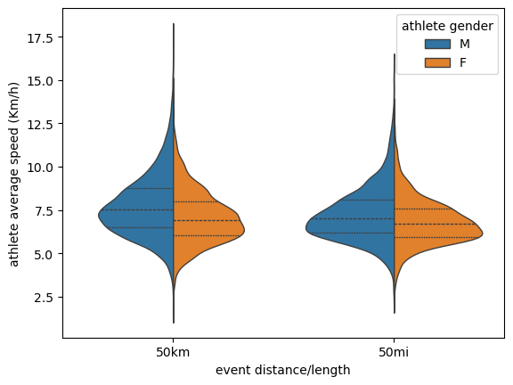

```python
import pandas as pd
import seaborn as sns
```


```python
df = pd.read_csv('TWO_CENTURIES_OF_UM_RACES.csv')
pd.set_option('display.max_columns', None)
```

    C:\Users\RollShotz\AppData\Local\Temp\ipykernel_4256\1329514069.py:1: DtypeWarning: Columns (11) have mixed types. Specify dtype option on import or set low_memory=False.
      df = pd.read_csv('TWO_CENTURIES_OF_UM_RACES.csv')
    

## Data Cleaning


```python
df.head(10)
```


<div>
<style scoped>
    .dataframe tbody tr th:only-of-type {
        vertical-align: middle;
    }

    .dataframe tbody tr th {
        vertical-align: top;
    }

    .dataframe thead th {
        text-align: right;
    }
</style>
<table border="1" class="dataframe">
  <thead>
    <tr style="text-align: right;">
      <th></th>
      <th>Year of event</th>
      <th>Event dates</th>
      <th>Event name</th>
      <th>Event distance/length</th>
      <th>Event number of finishers</th>
      <th>Athlete performance</th>
      <th>Athlete club</th>
      <th>Athlete country</th>
      <th>Athlete year of birth</th>
      <th>Athlete gender</th>
      <th>Athlete age category</th>
      <th>Athlete average speed</th>
      <th>Athlete ID</th>
    </tr>
  </thead>
  <tbody>
    <tr>
      <th>0</th>
      <td>2018</td>
      <td>06.01.2018</td>
      <td>Selva Costera (CHI)</td>
      <td>50km</td>
      <td>22</td>
      <td>4:51:39 h</td>
      <td>Tnfrc</td>
      <td>CHI</td>
      <td>1978.0</td>
      <td>M</td>
      <td>M35</td>
      <td>10.286</td>
      <td>0</td>
    </tr>
    <tr>
      <th>1</th>
      <td>2018</td>
      <td>06.01.2018</td>
      <td>Selva Costera (CHI)</td>
      <td>50km</td>
      <td>22</td>
      <td>5:15:45 h</td>
      <td>Roberto Echeverría</td>
      <td>CHI</td>
      <td>1981.0</td>
      <td>M</td>
      <td>M35</td>
      <td>9.501</td>
      <td>1</td>
    </tr>
    <tr>
      <th>2</th>
      <td>2018</td>
      <td>06.01.2018</td>
      <td>Selva Costera (CHI)</td>
      <td>50km</td>
      <td>22</td>
      <td>5:16:44 h</td>
      <td>Puro Trail Osorno</td>
      <td>CHI</td>
      <td>1987.0</td>
      <td>M</td>
      <td>M23</td>
      <td>9.472</td>
      <td>2</td>
    </tr>
    <tr>
      <th>3</th>
      <td>2018</td>
      <td>06.01.2018</td>
      <td>Selva Costera (CHI)</td>
      <td>50km</td>
      <td>22</td>
      <td>5:34:13 h</td>
      <td>Columbia</td>
      <td>ARG</td>
      <td>1976.0</td>
      <td>M</td>
      <td>M40</td>
      <td>8.976</td>
      <td>3</td>
    </tr>
    <tr>
      <th>4</th>
      <td>2018</td>
      <td>06.01.2018</td>
      <td>Selva Costera (CHI)</td>
      <td>50km</td>
      <td>22</td>
      <td>5:54:14 h</td>
      <td>Baguales Trail</td>
      <td>CHI</td>
      <td>1992.0</td>
      <td>M</td>
      <td>M23</td>
      <td>8.469</td>
      <td>4</td>
    </tr>
    <tr>
      <th>5</th>
      <td>2018</td>
      <td>06.01.2018</td>
      <td>Selva Costera (CHI)</td>
      <td>50km</td>
      <td>22</td>
      <td>6:25:01 h</td>
      <td>NaN</td>
      <td>ARG</td>
      <td>1974.0</td>
      <td>M</td>
      <td>M40</td>
      <td>7.792</td>
      <td>5</td>
    </tr>
    <tr>
      <th>6</th>
      <td>2018</td>
      <td>06.01.2018</td>
      <td>Selva Costera (CHI)</td>
      <td>50km</td>
      <td>22</td>
      <td>6:28:00 h</td>
      <td>Los Patagones</td>
      <td>ARG</td>
      <td>1979.0</td>
      <td>F</td>
      <td>W35</td>
      <td>7.732</td>
      <td>6</td>
    </tr>
    <tr>
      <th>7</th>
      <td>2018</td>
      <td>06.01.2018</td>
      <td>Selva Costera (CHI)</td>
      <td>50km</td>
      <td>22</td>
      <td>6:32:24 h</td>
      <td>Reaktiva Chile</td>
      <td>CHI</td>
      <td>1967.0</td>
      <td>F</td>
      <td>W50</td>
      <td>7.645</td>
      <td>7</td>
    </tr>
    <tr>
      <th>8</th>
      <td>2018</td>
      <td>06.01.2018</td>
      <td>Selva Costera (CHI)</td>
      <td>50km</td>
      <td>22</td>
      <td>6:39:08 h</td>
      <td>Puro Trail Osorno</td>
      <td>CHI</td>
      <td>1985.0</td>
      <td>M</td>
      <td>M23</td>
      <td>7.516</td>
      <td>8</td>
    </tr>
    <tr>
      <th>9</th>
      <td>2018</td>
      <td>06.01.2018</td>
      <td>Selva Costera (CHI)</td>
      <td>50km</td>
      <td>22</td>
      <td>6:45:11 h</td>
      <td>Marlene Flores Team</td>
      <td>CHI</td>
      <td>1976.0</td>
      <td>M</td>
      <td>M40</td>
      <td>7.404</td>
      <td>9</td>
    </tr>
  </tbody>
</table>
</div>


```python
df.columns
```


    Index(['Year of event', 'Event dates', 'Event name', 'Event distance/length',
           'Event number of finishers', 'Athlete performance', 'Athlete club',
           'Athlete country', 'Athlete year of birth', 'Athlete gender',
           'Athlete age category', 'Athlete average speed', 'Athlete ID'],
          dtype='object')


```python
df.head()
```


<div>
<style scoped>
    .dataframe tbody tr th:only-of-type {
        vertical-align: middle;
    }

    .dataframe tbody tr th {
        vertical-align: top;
    }

    .dataframe thead th {
        text-align: right;
    }
</style>
<table border="1" class="dataframe">
  <thead>
    <tr style="text-align: right;">
      <th></th>
      <th>Year of event</th>
      <th>Event dates</th>
      <th>Event name</th>
      <th>Event distance/length</th>
      <th>Event number of finishers</th>
      <th>Athlete performance</th>
      <th>Athlete club</th>
      <th>Athlete country</th>
      <th>Athlete year of birth</th>
      <th>Athlete gender</th>
      <th>Athlete age category</th>
      <th>Athlete average speed</th>
      <th>Athlete ID</th>
    </tr>
  </thead>
  <tbody>
    <tr>
      <th>0</th>
      <td>2018</td>
      <td>06.01.2018</td>
      <td>Selva Costera (CHI)</td>
      <td>50km</td>
      <td>22</td>
      <td>4:51:39 h</td>
      <td>Tnfrc</td>
      <td>CHI</td>
      <td>1978.0</td>
      <td>M</td>
      <td>M35</td>
      <td>10.286</td>
      <td>0</td>
    </tr>
    <tr>
      <th>1</th>
      <td>2018</td>
      <td>06.01.2018</td>
      <td>Selva Costera (CHI)</td>
      <td>50km</td>
      <td>22</td>
      <td>5:15:45 h</td>
      <td>Roberto Echeverría</td>
      <td>CHI</td>
      <td>1981.0</td>
      <td>M</td>
      <td>M35</td>
      <td>9.501</td>
      <td>1</td>
    </tr>
    <tr>
      <th>2</th>
      <td>2018</td>
      <td>06.01.2018</td>
      <td>Selva Costera (CHI)</td>
      <td>50km</td>
      <td>22</td>
      <td>5:16:44 h</td>
      <td>Puro Trail Osorno</td>
      <td>CHI</td>
      <td>1987.0</td>
      <td>M</td>
      <td>M23</td>
      <td>9.472</td>
      <td>2</td>
    </tr>
    <tr>
      <th>3</th>
      <td>2018</td>
      <td>06.01.2018</td>
      <td>Selva Costera (CHI)</td>
      <td>50km</td>
      <td>22</td>
      <td>5:34:13 h</td>
      <td>Columbia</td>
      <td>ARG</td>
      <td>1976.0</td>
      <td>M</td>
      <td>M40</td>
      <td>8.976</td>
      <td>3</td>
    </tr>
    <tr>
      <th>4</th>
      <td>2018</td>
      <td>06.01.2018</td>
      <td>Selva Costera (CHI)</td>
      <td>50km</td>
      <td>22</td>
      <td>5:54:14 h</td>
      <td>Baguales Trail</td>
      <td>CHI</td>
      <td>1992.0</td>
      <td>M</td>
      <td>M23</td>
      <td>8.469</td>
      <td>4</td>
    </tr>
  </tbody>
</table>
</div>


```python
df.shape
```


    (7461195, 13)


```python
df.dtypes
```


    Year of event                  int64
    Event dates                   object
    Event name                    object
    Event distance/length         object
    Event number of finishers      int64
    Athlete performance           object
    Athlete club                  object
    Athlete country               object
    Athlete year of birth        float64
    Athlete gender                object
    Athlete age category          object
    Athlete average speed         object
    Athlete ID                     int64
    dtype: object


### Filtering Races Based On: _1) Event Place: USA 2) Year of event: 2020 3) Event distance/length: 50km or 50mi_

1) USA events: Check if the _'Event name'_ contains '(USA)'
2) 2020 events: Filter the _'Year of event'_ column
3) 50km or 50mi Events: Filter _'Event distance/length'_ using 'isin()'


```python
df_filtered = df[(df['Event name'].str.contains('(USA)', na=False, regex=False)) & (df['Year of event'] == 2020) & (df['Event distance/length'].isin(['50km','50mi']))].copy()
```


```python
df_filtered.head()
```


<div>
<style scoped>
    .dataframe tbody tr th:only-of-type {
        vertical-align: middle;
    }

    .dataframe tbody tr th {
        vertical-align: top;
    }

    .dataframe thead th {
        text-align: right;
    }
</style>
<table border="1" class="dataframe">
  <thead>
    <tr style="text-align: right;">
      <th></th>
      <th>Year of event</th>
      <th>Event dates</th>
      <th>Event name</th>
      <th>Event distance/length</th>
      <th>Event number of finishers</th>
      <th>Athlete performance</th>
      <th>Athlete club</th>
      <th>Athlete country</th>
      <th>Athlete year of birth</th>
      <th>Athlete gender</th>
      <th>Athlete age category</th>
      <th>Athlete average speed</th>
      <th>Athlete ID</th>
    </tr>
  </thead>
  <tbody>
    <tr>
      <th>2539945</th>
      <td>2020</td>
      <td>02.02.2020</td>
      <td>West Seattle Beach Run - Winter Edition (USA)</td>
      <td>50km</td>
      <td>20</td>
      <td>3:17:55 h</td>
      <td>*Normandy Park, WA</td>
      <td>USA</td>
      <td>1991.0</td>
      <td>M</td>
      <td>M23</td>
      <td>15.158</td>
      <td>71287</td>
    </tr>
    <tr>
      <th>2539946</th>
      <td>2020</td>
      <td>02.02.2020</td>
      <td>West Seattle Beach Run - Winter Edition (USA)</td>
      <td>50km</td>
      <td>20</td>
      <td>4:02:32 h</td>
      <td>*Gold Bar, WA</td>
      <td>USA</td>
      <td>1981.0</td>
      <td>M</td>
      <td>M35</td>
      <td>12.369</td>
      <td>629508</td>
    </tr>
    <tr>
      <th>2539947</th>
      <td>2020</td>
      <td>02.02.2020</td>
      <td>West Seattle Beach Run - Winter Edition (USA)</td>
      <td>50km</td>
      <td>20</td>
      <td>4:07:57 h</td>
      <td>*Vashon, WA</td>
      <td>USA</td>
      <td>1999.0</td>
      <td>M</td>
      <td>MU23</td>
      <td>12.099</td>
      <td>64838</td>
    </tr>
    <tr>
      <th>2539948</th>
      <td>2020</td>
      <td>02.02.2020</td>
      <td>West Seattle Beach Run - Winter Edition (USA)</td>
      <td>50km</td>
      <td>20</td>
      <td>4:22:02 h</td>
      <td>*Gig Harbor, WA</td>
      <td>USA</td>
      <td>1983.0</td>
      <td>M</td>
      <td>M35</td>
      <td>11.449</td>
      <td>704450</td>
    </tr>
    <tr>
      <th>2539949</th>
      <td>2020</td>
      <td>02.02.2020</td>
      <td>West Seattle Beach Run - Winter Edition (USA)</td>
      <td>50km</td>
      <td>20</td>
      <td>4:27:34 h</td>
      <td>*Bainbridge Island, WA</td>
      <td>USA</td>
      <td>1977.0</td>
      <td>M</td>
      <td>M40</td>
      <td>11.212</td>
      <td>810281</td>
    </tr>
  </tbody>
</table>
</div>


```python
df_filtered.shape
```


    (26524, 13)


### Since we know all the events are taking place in USA we can remove '(USA)' ###


```python
df_filtered['Event name'] = df_filtered['Event name'].str.replace('(USA)', '', regex=False)
```


```python
df_filtered.head()
```


<div>
<style scoped>
    .dataframe tbody tr th:only-of-type {
        vertical-align: middle;
    }

    .dataframe tbody tr th {
        vertical-align: top;
    }

    .dataframe thead th {
        text-align: right;
    }
</style>
<table border="1" class="dataframe">
  <thead>
    <tr style="text-align: right;">
      <th></th>
      <th>Year of event</th>
      <th>Event dates</th>
      <th>Event name</th>
      <th>Event distance/length</th>
      <th>Event number of finishers</th>
      <th>Athlete performance</th>
      <th>Athlete club</th>
      <th>Athlete country</th>
      <th>Athlete year of birth</th>
      <th>Athlete gender</th>
      <th>Athlete age category</th>
      <th>Athlete average speed</th>
      <th>Athlete ID</th>
    </tr>
  </thead>
  <tbody>
    <tr>
      <th>2539945</th>
      <td>2020</td>
      <td>02.02.2020</td>
      <td>West Seattle Beach Run - Winter Edition</td>
      <td>50km</td>
      <td>20</td>
      <td>3:17:55 h</td>
      <td>*Normandy Park, WA</td>
      <td>USA</td>
      <td>1991.0</td>
      <td>M</td>
      <td>M23</td>
      <td>15.158</td>
      <td>71287</td>
    </tr>
    <tr>
      <th>2539946</th>
      <td>2020</td>
      <td>02.02.2020</td>
      <td>West Seattle Beach Run - Winter Edition</td>
      <td>50km</td>
      <td>20</td>
      <td>4:02:32 h</td>
      <td>*Gold Bar, WA</td>
      <td>USA</td>
      <td>1981.0</td>
      <td>M</td>
      <td>M35</td>
      <td>12.369</td>
      <td>629508</td>
    </tr>
    <tr>
      <th>2539947</th>
      <td>2020</td>
      <td>02.02.2020</td>
      <td>West Seattle Beach Run - Winter Edition</td>
      <td>50km</td>
      <td>20</td>
      <td>4:07:57 h</td>
      <td>*Vashon, WA</td>
      <td>USA</td>
      <td>1999.0</td>
      <td>M</td>
      <td>MU23</td>
      <td>12.099</td>
      <td>64838</td>
    </tr>
    <tr>
      <th>2539948</th>
      <td>2020</td>
      <td>02.02.2020</td>
      <td>West Seattle Beach Run - Winter Edition</td>
      <td>50km</td>
      <td>20</td>
      <td>4:22:02 h</td>
      <td>*Gig Harbor, WA</td>
      <td>USA</td>
      <td>1983.0</td>
      <td>M</td>
      <td>M35</td>
      <td>11.449</td>
      <td>704450</td>
    </tr>
    <tr>
      <th>2539949</th>
      <td>2020</td>
      <td>02.02.2020</td>
      <td>West Seattle Beach Run - Winter Edition</td>
      <td>50km</td>
      <td>20</td>
      <td>4:27:34 h</td>
      <td>*Bainbridge Island, WA</td>
      <td>USA</td>
      <td>1977.0</td>
      <td>M</td>
      <td>M40</td>
      <td>11.212</td>
      <td>810281</td>
    </tr>
  </tbody>
</table>
</div>


### Now, let's create a column named 'Athlete age'. For this we can extract the numeric portion from the 'Athlete age category' column


```python
df_filtered['Athlete age'] = df_filtered['Athlete age category'].str.extract(r'(\d+)')
```

**'(\d+)' extracts numeric portion leaving out the alphabetic portion**


```python
df_filtered.head()
```


<div>
<style scoped>
    .dataframe tbody tr th:only-of-type {
        vertical-align: middle;
    }

    .dataframe tbody tr th {
        vertical-align: top;
    }

    .dataframe thead th {
        text-align: right;
    }
</style>
<table border="1" class="dataframe">
  <thead>
    <tr style="text-align: right;">
      <th></th>
      <th>Year of event</th>
      <th>Event dates</th>
      <th>Event name</th>
      <th>Event distance/length</th>
      <th>Event number of finishers</th>
      <th>Athlete performance</th>
      <th>Athlete club</th>
      <th>Athlete country</th>
      <th>Athlete year of birth</th>
      <th>Athlete gender</th>
      <th>Athlete age category</th>
      <th>Athlete average speed</th>
      <th>Athlete ID</th>
      <th>Athlete age</th>
    </tr>
  </thead>
  <tbody>
    <tr>
      <th>2539945</th>
      <td>2020</td>
      <td>02.02.2020</td>
      <td>West Seattle Beach Run - Winter Edition</td>
      <td>50km</td>
      <td>20</td>
      <td>3:17:55 h</td>
      <td>*Normandy Park, WA</td>
      <td>USA</td>
      <td>1991.0</td>
      <td>M</td>
      <td>M23</td>
      <td>15.158</td>
      <td>71287</td>
      <td>23</td>
    </tr>
    <tr>
      <th>2539946</th>
      <td>2020</td>
      <td>02.02.2020</td>
      <td>West Seattle Beach Run - Winter Edition</td>
      <td>50km</td>
      <td>20</td>
      <td>4:02:32 h</td>
      <td>*Gold Bar, WA</td>
      <td>USA</td>
      <td>1981.0</td>
      <td>M</td>
      <td>M35</td>
      <td>12.369</td>
      <td>629508</td>
      <td>35</td>
    </tr>
    <tr>
      <th>2539947</th>
      <td>2020</td>
      <td>02.02.2020</td>
      <td>West Seattle Beach Run - Winter Edition</td>
      <td>50km</td>
      <td>20</td>
      <td>4:07:57 h</td>
      <td>*Vashon, WA</td>
      <td>USA</td>
      <td>1999.0</td>
      <td>M</td>
      <td>MU23</td>
      <td>12.099</td>
      <td>64838</td>
      <td>23</td>
    </tr>
    <tr>
      <th>2539948</th>
      <td>2020</td>
      <td>02.02.2020</td>
      <td>West Seattle Beach Run - Winter Edition</td>
      <td>50km</td>
      <td>20</td>
      <td>4:22:02 h</td>
      <td>*Gig Harbor, WA</td>
      <td>USA</td>
      <td>1983.0</td>
      <td>M</td>
      <td>M35</td>
      <td>11.449</td>
      <td>704450</td>
      <td>35</td>
    </tr>
    <tr>
      <th>2539949</th>
      <td>2020</td>
      <td>02.02.2020</td>
      <td>West Seattle Beach Run - Winter Edition</td>
      <td>50km</td>
      <td>20</td>
      <td>4:27:34 h</td>
      <td>*Bainbridge Island, WA</td>
      <td>USA</td>
      <td>1977.0</td>
      <td>M</td>
      <td>M40</td>
      <td>11.212</td>
      <td>810281</td>
      <td>40</td>
    </tr>
  </tbody>
</table>
</div>


### Remove 'h' from 'Athlete performance' column


```python
df_filtered['Athlete performance'] = df_filtered['Athlete performance'].str.replace(' h', '')
```


```python
df_filtered.head()
```


<div>
<style scoped>
    .dataframe tbody tr th:only-of-type {
        vertical-align: middle;
    }

    .dataframe tbody tr th {
        vertical-align: top;
    }

    .dataframe thead th {
        text-align: right;
    }
</style>
<table border="1" class="dataframe">
  <thead>
    <tr style="text-align: right;">
      <th></th>
      <th>Year of event</th>
      <th>Event dates</th>
      <th>Event name</th>
      <th>Event distance/length</th>
      <th>Event number of finishers</th>
      <th>Athlete performance</th>
      <th>Athlete club</th>
      <th>Athlete country</th>
      <th>Athlete year of birth</th>
      <th>Athlete gender</th>
      <th>Athlete age category</th>
      <th>Athlete average speed</th>
      <th>Athlete ID</th>
      <th>Athlete age</th>
    </tr>
  </thead>
  <tbody>
    <tr>
      <th>2539945</th>
      <td>2020</td>
      <td>02.02.2020</td>
      <td>West Seattle Beach Run - Winter Edition</td>
      <td>50km</td>
      <td>20</td>
      <td>3:17:55</td>
      <td>*Normandy Park, WA</td>
      <td>USA</td>
      <td>1991.0</td>
      <td>M</td>
      <td>M23</td>
      <td>15.158</td>
      <td>71287</td>
      <td>23</td>
    </tr>
    <tr>
      <th>2539946</th>
      <td>2020</td>
      <td>02.02.2020</td>
      <td>West Seattle Beach Run - Winter Edition</td>
      <td>50km</td>
      <td>20</td>
      <td>4:02:32</td>
      <td>*Gold Bar, WA</td>
      <td>USA</td>
      <td>1981.0</td>
      <td>M</td>
      <td>M35</td>
      <td>12.369</td>
      <td>629508</td>
      <td>35</td>
    </tr>
    <tr>
      <th>2539947</th>
      <td>2020</td>
      <td>02.02.2020</td>
      <td>West Seattle Beach Run - Winter Edition</td>
      <td>50km</td>
      <td>20</td>
      <td>4:07:57</td>
      <td>*Vashon, WA</td>
      <td>USA</td>
      <td>1999.0</td>
      <td>M</td>
      <td>MU23</td>
      <td>12.099</td>
      <td>64838</td>
      <td>23</td>
    </tr>
    <tr>
      <th>2539948</th>
      <td>2020</td>
      <td>02.02.2020</td>
      <td>West Seattle Beach Run - Winter Edition</td>
      <td>50km</td>
      <td>20</td>
      <td>4:22:02</td>
      <td>*Gig Harbor, WA</td>
      <td>USA</td>
      <td>1983.0</td>
      <td>M</td>
      <td>M35</td>
      <td>11.449</td>
      <td>704450</td>
      <td>35</td>
    </tr>
    <tr>
      <th>2539949</th>
      <td>2020</td>
      <td>02.02.2020</td>
      <td>West Seattle Beach Run - Winter Edition</td>
      <td>50km</td>
      <td>20</td>
      <td>4:27:34</td>
      <td>*Bainbridge Island, WA</td>
      <td>USA</td>
      <td>1977.0</td>
      <td>M</td>
      <td>M40</td>
      <td>11.212</td>
      <td>810281</td>
      <td>40</td>
    </tr>
  </tbody>
</table>
</div>


### Now let's drop the columns we won't be using: Athlete club, Athlete country, Athlete year of birth, Athlete age category


```python
df_filtered = df_filtered.drop(['Year of event', 'Athlete club', 'Athlete country', 'Athlete year of birth', 'Athlete age category'], axis=1)
```


```python
df_filtered.head()
```


<div>
<style scoped>
    .dataframe tbody tr th:only-of-type {
        vertical-align: middle;
    }

    .dataframe tbody tr th {
        vertical-align: top;
    }

    .dataframe thead th {
        text-align: right;
    }
</style>
<table border="1" class="dataframe">
  <thead>
    <tr style="text-align: right;">
      <th></th>
      <th>Event dates</th>
      <th>Event name</th>
      <th>Event distance/length</th>
      <th>Event number of finishers</th>
      <th>Athlete performance</th>
      <th>Athlete gender</th>
      <th>Athlete average speed</th>
      <th>Athlete ID</th>
      <th>Athlete age</th>
    </tr>
  </thead>
  <tbody>
    <tr>
      <th>2539945</th>
      <td>02.02.2020</td>
      <td>West Seattle Beach Run - Winter Edition</td>
      <td>50km</td>
      <td>20</td>
      <td>3:17:55</td>
      <td>M</td>
      <td>15.158</td>
      <td>71287</td>
      <td>23</td>
    </tr>
    <tr>
      <th>2539946</th>
      <td>02.02.2020</td>
      <td>West Seattle Beach Run - Winter Edition</td>
      <td>50km</td>
      <td>20</td>
      <td>4:02:32</td>
      <td>M</td>
      <td>12.369</td>
      <td>629508</td>
      <td>35</td>
    </tr>
    <tr>
      <th>2539947</th>
      <td>02.02.2020</td>
      <td>West Seattle Beach Run - Winter Edition</td>
      <td>50km</td>
      <td>20</td>
      <td>4:07:57</td>
      <td>M</td>
      <td>12.099</td>
      <td>64838</td>
      <td>23</td>
    </tr>
    <tr>
      <th>2539948</th>
      <td>02.02.2020</td>
      <td>West Seattle Beach Run - Winter Edition</td>
      <td>50km</td>
      <td>20</td>
      <td>4:22:02</td>
      <td>M</td>
      <td>11.449</td>
      <td>704450</td>
      <td>35</td>
    </tr>
    <tr>
      <th>2539949</th>
      <td>02.02.2020</td>
      <td>West Seattle Beach Run - Winter Edition</td>
      <td>50km</td>
      <td>20</td>
      <td>4:27:34</td>
      <td>M</td>
      <td>11.212</td>
      <td>810281</td>
      <td>40</td>
    </tr>
  </tbody>
</table>
</div>


### Clean up null values


```python
df_filtered.isna().sum()
```


    Event dates                    0
    Event name                     0
    Event distance/length          0
    Event number of finishers      0
    Athlete performance            0
    Athlete gender                 0
    Athlete average speed          0
    Athlete ID                     0
    Athlete age                  218
    dtype: int64


```python
df_filtered[df_filtered['Athlete age'].isna()]
```


<div>
<style scoped>
    .dataframe tbody tr th:only-of-type {
        vertical-align: middle;
    }

    .dataframe tbody tr th {
        vertical-align: top;
    }

    .dataframe thead th {
        text-align: right;
    }
</style>
<table border="1" class="dataframe">
  <thead>
    <tr style="text-align: right;">
      <th></th>
      <th>Event dates</th>
      <th>Event name</th>
      <th>Event distance/length</th>
      <th>Event number of finishers</th>
      <th>Athlete performance</th>
      <th>Athlete gender</th>
      <th>Athlete average speed</th>
      <th>Athlete ID</th>
      <th>Athlete age</th>
    </tr>
  </thead>
  <tbody>
    <tr>
      <th>2547794</th>
      <td>25.01.2020</td>
      <td>North Carolina Fat Ass 50 Km</td>
      <td>50km</td>
      <td>57</td>
      <td>6:10:30</td>
      <td>M</td>
      <td>8.097</td>
      <td>811923</td>
      <td>NaN</td>
    </tr>
    <tr>
      <th>2551331</th>
      <td>19.01.2020</td>
      <td>Big Bend 50 - Fresno Creek 50K</td>
      <td>50km</td>
      <td>54</td>
      <td>4:46:34</td>
      <td>M</td>
      <td>10.469</td>
      <td>812656</td>
      <td>NaN</td>
    </tr>
    <tr>
      <th>2551336</th>
      <td>19.01.2020</td>
      <td>Big Bend 50 - Fresno Creek 50K</td>
      <td>50km</td>
      <td>54</td>
      <td>5:08:36</td>
      <td>M</td>
      <td>9.721</td>
      <td>812657</td>
      <td>NaN</td>
    </tr>
    <tr>
      <th>2551344</th>
      <td>19.01.2020</td>
      <td>Big Bend 50 - Fresno Creek 50K</td>
      <td>50km</td>
      <td>54</td>
      <td>5:54:04</td>
      <td>F</td>
      <td>8.473</td>
      <td>658221</td>
      <td>NaN</td>
    </tr>
    <tr>
      <th>2551348</th>
      <td>19.01.2020</td>
      <td>Big Bend 50 - Fresno Creek 50K</td>
      <td>50km</td>
      <td>54</td>
      <td>6:07:11</td>
      <td>M</td>
      <td>8.17</td>
      <td>812660</td>
      <td>NaN</td>
    </tr>
    <tr>
      <th>...</th>
      <td>...</td>
      <td>...</td>
      <td>...</td>
      <td>...</td>
      <td>...</td>
      <td>...</td>
      <td>...</td>
      <td>...</td>
      <td>...</td>
    </tr>
    <tr>
      <th>2746543</th>
      <td>17.10.2020</td>
      <td>Black River Trail Classic 50 Km</td>
      <td>50km</td>
      <td>8</td>
      <td>8:31:26</td>
      <td>F</td>
      <td>5.866</td>
      <td>857251</td>
      <td>NaN</td>
    </tr>
    <tr>
      <th>2749869</th>
      <td>17.10.2020</td>
      <td>MuleSkinner Endurance 50 Mile Race</td>
      <td>50mi</td>
      <td>27</td>
      <td>11:55:05</td>
      <td>M</td>
      <td>6.752</td>
      <td>857957</td>
      <td>NaN</td>
    </tr>
    <tr>
      <th>2755985</th>
      <td>10.10.2020</td>
      <td>Man Against Horse 50 Mile Race</td>
      <td>50mi</td>
      <td>23</td>
      <td>9:03:25</td>
      <td>M</td>
      <td>8.885</td>
      <td>859462</td>
      <td>NaN</td>
    </tr>
    <tr>
      <th>2755994</th>
      <td>10.10.2020</td>
      <td>Man Against Horse 50 Mile Race</td>
      <td>50mi</td>
      <td>23</td>
      <td>10:37:00</td>
      <td>M</td>
      <td>7.579</td>
      <td>398583</td>
      <td>NaN</td>
    </tr>
    <tr>
      <th>2755997</th>
      <td>10.10.2020</td>
      <td>Man Against Horse 50 Mile Race</td>
      <td>50mi</td>
      <td>23</td>
      <td>12:30:00</td>
      <td>M</td>
      <td>6.437</td>
      <td>859465</td>
      <td>NaN</td>
    </tr>
  </tbody>
</table>
<p>218 rows × 9 columns</p>
</div>


### Let's drop these rows which contain null values


```python
df_filtered = df_filtered.dropna()
```


```python
df_filtered.head()
```


<div>
<style scoped>
    .dataframe tbody tr th:only-of-type {
        vertical-align: middle;
    }

    .dataframe tbody tr th {
        vertical-align: top;
    }

    .dataframe thead th {
        text-align: right;
    }
</style>
<table border="1" class="dataframe">
  <thead>
    <tr style="text-align: right;">
      <th></th>
      <th>Event dates</th>
      <th>Event name</th>
      <th>Event distance/length</th>
      <th>Event number of finishers</th>
      <th>Athlete performance</th>
      <th>Athlete gender</th>
      <th>Athlete average speed</th>
      <th>Athlete ID</th>
      <th>Athlete age</th>
    </tr>
  </thead>
  <tbody>
    <tr>
      <th>2539945</th>
      <td>02.02.2020</td>
      <td>West Seattle Beach Run - Winter Edition</td>
      <td>50km</td>
      <td>20</td>
      <td>3:17:55</td>
      <td>M</td>
      <td>15.158</td>
      <td>71287</td>
      <td>23</td>
    </tr>
    <tr>
      <th>2539946</th>
      <td>02.02.2020</td>
      <td>West Seattle Beach Run - Winter Edition</td>
      <td>50km</td>
      <td>20</td>
      <td>4:02:32</td>
      <td>M</td>
      <td>12.369</td>
      <td>629508</td>
      <td>35</td>
    </tr>
    <tr>
      <th>2539947</th>
      <td>02.02.2020</td>
      <td>West Seattle Beach Run - Winter Edition</td>
      <td>50km</td>
      <td>20</td>
      <td>4:07:57</td>
      <td>M</td>
      <td>12.099</td>
      <td>64838</td>
      <td>23</td>
    </tr>
    <tr>
      <th>2539948</th>
      <td>02.02.2020</td>
      <td>West Seattle Beach Run - Winter Edition</td>
      <td>50km</td>
      <td>20</td>
      <td>4:22:02</td>
      <td>M</td>
      <td>11.449</td>
      <td>704450</td>
      <td>35</td>
    </tr>
    <tr>
      <th>2539949</th>
      <td>02.02.2020</td>
      <td>West Seattle Beach Run - Winter Edition</td>
      <td>50km</td>
      <td>20</td>
      <td>4:27:34</td>
      <td>M</td>
      <td>11.212</td>
      <td>810281</td>
      <td>40</td>
    </tr>
  </tbody>
</table>
</div>


### Let's check for duplicate values


```python
df_filtered.duplicated().sum()
```


    0


**Nice, there is no duplicated rows!**

### Now let's reset the index


```python
df_filtered.reset_index(drop=True)
```


<div>
<style scoped>
    .dataframe tbody tr th:only-of-type {
        vertical-align: middle;
    }

    .dataframe tbody tr th {
        vertical-align: top;
    }

    .dataframe thead th {
        text-align: right;
    }
</style>
<table border="1" class="dataframe">
  <thead>
    <tr style="text-align: right;">
      <th></th>
      <th>Event dates</th>
      <th>Event name</th>
      <th>Event distance/length</th>
      <th>Event number of finishers</th>
      <th>Athlete performance</th>
      <th>Athlete gender</th>
      <th>Athlete average speed</th>
      <th>Athlete ID</th>
      <th>Athlete age</th>
    </tr>
  </thead>
  <tbody>
    <tr>
      <th>0</th>
      <td>02.02.2020</td>
      <td>West Seattle Beach Run - Winter Edition</td>
      <td>50km</td>
      <td>20</td>
      <td>3:17:55</td>
      <td>M</td>
      <td>15.158</td>
      <td>71287</td>
      <td>23</td>
    </tr>
    <tr>
      <th>1</th>
      <td>02.02.2020</td>
      <td>West Seattle Beach Run - Winter Edition</td>
      <td>50km</td>
      <td>20</td>
      <td>4:02:32</td>
      <td>M</td>
      <td>12.369</td>
      <td>629508</td>
      <td>35</td>
    </tr>
    <tr>
      <th>2</th>
      <td>02.02.2020</td>
      <td>West Seattle Beach Run - Winter Edition</td>
      <td>50km</td>
      <td>20</td>
      <td>4:07:57</td>
      <td>M</td>
      <td>12.099</td>
      <td>64838</td>
      <td>23</td>
    </tr>
    <tr>
      <th>3</th>
      <td>02.02.2020</td>
      <td>West Seattle Beach Run - Winter Edition</td>
      <td>50km</td>
      <td>20</td>
      <td>4:22:02</td>
      <td>M</td>
      <td>11.449</td>
      <td>704450</td>
      <td>35</td>
    </tr>
    <tr>
      <th>4</th>
      <td>02.02.2020</td>
      <td>West Seattle Beach Run - Winter Edition</td>
      <td>50km</td>
      <td>20</td>
      <td>4:27:34</td>
      <td>M</td>
      <td>11.212</td>
      <td>810281</td>
      <td>40</td>
    </tr>
    <tr>
      <th>...</th>
      <td>...</td>
      <td>...</td>
      <td>...</td>
      <td>...</td>
      <td>...</td>
      <td>...</td>
      <td>...</td>
      <td>...</td>
      <td>...</td>
    </tr>
    <tr>
      <th>26301</th>
      <td>03.10.2020</td>
      <td>Yankee Springs Fall Trail Run Festival</td>
      <td>50km</td>
      <td>30</td>
      <td>7:07:48</td>
      <td>F</td>
      <td>7.013</td>
      <td>816361</td>
      <td>60</td>
    </tr>
    <tr>
      <th>26302</th>
      <td>03.10.2020</td>
      <td>Yankee Springs Fall Trail Run Festival</td>
      <td>50km</td>
      <td>30</td>
      <td>7:27:22</td>
      <td>F</td>
      <td>6.706</td>
      <td>326469</td>
      <td>40</td>
    </tr>
    <tr>
      <th>26303</th>
      <td>03.10.2020</td>
      <td>Yankee Springs Fall Trail Run Festival</td>
      <td>50km</td>
      <td>30</td>
      <td>7:27:24</td>
      <td>F</td>
      <td>6.705</td>
      <td>372174</td>
      <td>55</td>
    </tr>
    <tr>
      <th>26304</th>
      <td>03.10.2020</td>
      <td>Yankee Springs Fall Trail Run Festival</td>
      <td>50km</td>
      <td>30</td>
      <td>7:38:30</td>
      <td>F</td>
      <td>6.543</td>
      <td>860349</td>
      <td>35</td>
    </tr>
    <tr>
      <th>26305</th>
      <td>03.10.2020</td>
      <td>Yankee Springs Fall Trail Run Festival</td>
      <td>50km</td>
      <td>30</td>
      <td>7:59:53</td>
      <td>M</td>
      <td>6.252</td>
      <td>770097</td>
      <td>35</td>
    </tr>
  </tbody>
</table>
<p>26306 rows × 9 columns</p>
</div>


### Fix the data types


```python
df_filtered['Athlete age'] = df_filtered['Athlete age'].astype(int)
```


```python
df_filtered['Athlete average speed'] = df_filtered['Athlete average speed'].astype(float)
```


```python
df_filtered.dtypes
```


    Event dates                   object
    Event name                    object
    Event distance/length         object
    Event number of finishers      int64
    Athlete performance           object
    Athlete gender                object
    Athlete average speed        float64
    Athlete ID                     int64
    Athlete age                    int32
    dtype: object


### Now let's rename columns

#### Firstly, let's lower case the column names as it will be less likely for us to make mistakes


```python
df_filtered.columns = df_filtered.columns.str.lower()
```


```python
df_filtered.columns
```


    Index(['event dates', 'event name', 'event distance/length',
           'event number of finishers', 'athlete performance', 'athlete gender',
           'athlete average speed', 'athlete id', 'athlete age'],
          dtype='object')


#### Also, let's add the unit of average speed column for better clarity


```python
df_filtered.rename(columns={'athlete average speed':'athlete average speed (Km/h)'}, inplace=True)
```


```python
df_filtered.head()
```


<div>
<style scoped>
    .dataframe tbody tr th:only-of-type {
        vertical-align: middle;
    }

    .dataframe tbody tr th {
        vertical-align: top;
    }

    .dataframe thead th {
        text-align: right;
    }
</style>
<table border="1" class="dataframe">
  <thead>
    <tr style="text-align: right;">
      <th></th>
      <th>event dates</th>
      <th>event name</th>
      <th>event distance/length</th>
      <th>event number of finishers</th>
      <th>athlete performance</th>
      <th>athlete gender</th>
      <th>athlete average speed (Km/h)</th>
      <th>athlete id</th>
      <th>athlete age</th>
    </tr>
  </thead>
  <tbody>
    <tr>
      <th>2539945</th>
      <td>02.02.2020</td>
      <td>West Seattle Beach Run - Winter Edition</td>
      <td>50km</td>
      <td>20</td>
      <td>3:17:55</td>
      <td>M</td>
      <td>15.158</td>
      <td>71287</td>
      <td>23</td>
    </tr>
    <tr>
      <th>2539946</th>
      <td>02.02.2020</td>
      <td>West Seattle Beach Run - Winter Edition</td>
      <td>50km</td>
      <td>20</td>
      <td>4:02:32</td>
      <td>M</td>
      <td>12.369</td>
      <td>629508</td>
      <td>35</td>
    </tr>
    <tr>
      <th>2539947</th>
      <td>02.02.2020</td>
      <td>West Seattle Beach Run - Winter Edition</td>
      <td>50km</td>
      <td>20</td>
      <td>4:07:57</td>
      <td>M</td>
      <td>12.099</td>
      <td>64838</td>
      <td>23</td>
    </tr>
    <tr>
      <th>2539948</th>
      <td>02.02.2020</td>
      <td>West Seattle Beach Run - Winter Edition</td>
      <td>50km</td>
      <td>20</td>
      <td>4:22:02</td>
      <td>M</td>
      <td>11.449</td>
      <td>704450</td>
      <td>35</td>
    </tr>
    <tr>
      <th>2539949</th>
      <td>02.02.2020</td>
      <td>West Seattle Beach Run - Winter Edition</td>
      <td>50km</td>
      <td>20</td>
      <td>4:27:34</td>
      <td>M</td>
      <td>11.212</td>
      <td>810281</td>
      <td>40</td>
    </tr>
  </tbody>
</table>
</div>


## Chart's and Graphs

### 50km vs 50mi races


```python
sns.histplot(df_filtered['event distance/length'])
```


    <Axes: xlabel='event distance/length', ylabel='Count'>


    

    


### Portion of Male vs Female in 50km vs 50mi


```python
sns.histplot(df_filtered, x='event distance/length', hue='athlete gender',  palette={'M': 'blue', 'F': 'pink'},  multiple='stack')
```


    <Axes: xlabel='event distance/length', ylabel='Count'>


    

    


### Let's have a look at the distribution of average speed in the 50mi races


```python
sns.displot(df_filtered[df_filtered['event distance/length'] == '50mi']['athlete average speed (Km/h)'])
```


    <seaborn.axisgrid.FacetGrid at 0x1bede383290>


    

    


**As it can be seen it's common that athletes have an average speed of 6-8 km/h in 50mi race lengths**

### Now let's plot violinplot to compare male vs female average speeds in 50km vs 50mi


```python
sns.violinplot(df_filtered, x='event distance/length', y='athlete average speed (Km/h)', hue='athlete gender', split=True, inner='quarts', linewidth=1)
```


    <Axes: xlabel='event distance/length', ylabel='athlete average speed (Km/h)'>


    

    


**Males tend to have higher average speeds in shorter marathons like the 50km. However, it seems that females get closer to males average speed
in longer distance marathons like the 50mi**

### Let's also plot an lmplot:


```python
sns.lmplot(df_filtered, x= 'athlete age', y= 'athlete average speed (Km/h)', hue= 'athlete gender')
```


    <seaborn.axisgrid.FacetGrid at 0x1bede3cb470>


    

    


**Understandings:
1- As someone gets older they tend to get slower
2- Female and male athlete average speed seems to get closer together as they get older**

## Questions I want to find out from the data

### _Difference in speed for the 50km, 50mi male to female?_


```python
df_filtered.groupby(['event distance/length', 'athlete gender'])['athlete average speed (Km/h)'].mean()
```


    event distance/length  athlete gender
    50km                   F                 7.092093
                           M                 7.743352
    50mi                   F                 6.830764
                           M                 7.249346
    Name: athlete average speed (Km/h), dtype: float64


### What age groups are the best in the 50mi Race (Age groups with 20 races minimum) (Top 4)


```python
df_filtered.query('`event distance/length` == "50mi"').groupby('athlete age')['athlete average speed (Km/h)'].agg(['mean', 'count']).sort_values('mean', ascending = False).query('count>19').head(4)
```


<div>
<style scoped>
    .dataframe tbody tr th:only-of-type {
        vertical-align: middle;
    }

    .dataframe tbody tr th {
        vertical-align: top;
    }

    .dataframe thead th {
        text-align: right;
    }
</style>
<table border="1" class="dataframe">
  <thead>
    <tr style="text-align: right;">
      <th></th>
      <th>mean</th>
      <th>count</th>
    </tr>
    <tr>
      <th>athlete age</th>
      <th></th>
      <th></th>
    </tr>
  </thead>
  <tbody>
    <tr>
      <th>23</th>
      <td>7.425329</td>
      <td>1794</td>
    </tr>
    <tr>
      <th>35</th>
      <td>7.330124</td>
      <td>1100</td>
    </tr>
    <tr>
      <th>40</th>
      <td>7.109295</td>
      <td>911</td>
    </tr>
    <tr>
      <th>45</th>
      <td>6.864055</td>
      <td>799</td>
    </tr>
  </tbody>
</table>
</div>


### What age groups are the worst in the 50mi Race (Age groups with 20 races minimum) (Buttom 4)


```python
df_filtered.query('`event distance/length` == "50mi"').groupby('athlete age')['athlete average speed (Km/h)'].agg(['mean', 'count']).sort_values('mean', ascending = True).query('count>19').head(4)
```


<div>
<style scoped>
    .dataframe tbody tr th:only-of-type {
        vertical-align: middle;
    }

    .dataframe tbody tr th {
        vertical-align: top;
    }

    .dataframe thead th {
        text-align: right;
    }
</style>
<table border="1" class="dataframe">
  <thead>
    <tr style="text-align: right;">
      <th></th>
      <th>mean</th>
      <th>count</th>
    </tr>
    <tr>
      <th>athlete age</th>
      <th></th>
      <th></th>
    </tr>
  </thead>
  <tbody>
    <tr>
      <th>70</th>
      <td>5.854450</td>
      <td>20</td>
    </tr>
    <tr>
      <th>65</th>
      <td>5.981080</td>
      <td>50</td>
    </tr>
    <tr>
      <th>60</th>
      <td>6.353036</td>
      <td>137</td>
    </tr>
    <tr>
      <th>55</th>
      <td>6.660749</td>
      <td>331</td>
    </tr>
  </tbody>
</table>
</div>


### Effect of the season: Are runners slower in summer compared to winter?


```python
df_filtered['event dates'] = df_filtered['event dates'].str.replace('-', '')
df_filtered['race month'] = df_filtered['event dates'].apply(lambda x: x.split('.')[1] if len(x.split('.')) == 3 else x.split('.')[2]).astype(int)
```


```python
df_filtered.head()
```


<div>
<style scoped>
    .dataframe tbody tr th:only-of-type {
        vertical-align: middle;
    }

    .dataframe tbody tr th {
        vertical-align: top;
    }

    .dataframe thead th {
        text-align: right;
    }
</style>
<table border="1" class="dataframe">
  <thead>
    <tr style="text-align: right;">
      <th></th>
      <th>event dates</th>
      <th>event name</th>
      <th>event distance/length</th>
      <th>event number of finishers</th>
      <th>athlete performance</th>
      <th>athlete gender</th>
      <th>athlete average speed (Km/h)</th>
      <th>athlete id</th>
      <th>athlete age</th>
      <th>race month</th>
    </tr>
  </thead>
  <tbody>
    <tr>
      <th>2539945</th>
      <td>02.02.2020</td>
      <td>West Seattle Beach Run - Winter Edition</td>
      <td>50km</td>
      <td>20</td>
      <td>3:17:55</td>
      <td>M</td>
      <td>15.158</td>
      <td>71287</td>
      <td>23</td>
      <td>2</td>
    </tr>
    <tr>
      <th>2539946</th>
      <td>02.02.2020</td>
      <td>West Seattle Beach Run - Winter Edition</td>
      <td>50km</td>
      <td>20</td>
      <td>4:02:32</td>
      <td>M</td>
      <td>12.369</td>
      <td>629508</td>
      <td>35</td>
      <td>2</td>
    </tr>
    <tr>
      <th>2539947</th>
      <td>02.02.2020</td>
      <td>West Seattle Beach Run - Winter Edition</td>
      <td>50km</td>
      <td>20</td>
      <td>4:07:57</td>
      <td>M</td>
      <td>12.099</td>
      <td>64838</td>
      <td>23</td>
      <td>2</td>
    </tr>
    <tr>
      <th>2539948</th>
      <td>02.02.2020</td>
      <td>West Seattle Beach Run - Winter Edition</td>
      <td>50km</td>
      <td>20</td>
      <td>4:22:02</td>
      <td>M</td>
      <td>11.449</td>
      <td>704450</td>
      <td>35</td>
      <td>2</td>
    </tr>
    <tr>
      <th>2539949</th>
      <td>02.02.2020</td>
      <td>West Seattle Beach Run - Winter Edition</td>
      <td>50km</td>
      <td>20</td>
      <td>4:27:34</td>
      <td>M</td>
      <td>11.212</td>
      <td>810281</td>
      <td>40</td>
      <td>2</td>
    </tr>
  </tbody>
</table>
</div>


```python
df_filtered['race season'] = df_filtered['race month'].apply(lambda x: 'Winter' if x > 11 else 'Fall' if x > 8 else 'Summer' if x > 5 else 'Spring' if x > 2 else 'Winter')
```


```python
df_filtered.groupby('race season')['athlete average speed (Km/h)'].agg(['mean', 'count']).sort_values('mean', ascending = False)
```


<div>
<style scoped>
    .dataframe tbody tr th:only-of-type {
        vertical-align: middle;
    }

    .dataframe tbody tr th {
        vertical-align: top;
    }

    .dataframe thead th {
        text-align: right;
    }
</style>
<table border="1" class="dataframe">
  <thead>
    <tr style="text-align: right;">
      <th></th>
      <th>mean</th>
      <th>count</th>
    </tr>
    <tr>
      <th>race season</th>
      <th></th>
      <th></th>
    </tr>
  </thead>
  <tbody>
    <tr>
      <th>Spring</th>
      <td>7.703898</td>
      <td>3387</td>
    </tr>
    <tr>
      <th>Winter</th>
      <td>7.585664</td>
      <td>10863</td>
    </tr>
    <tr>
      <th>Fall</th>
      <td>7.366869</td>
      <td>9117</td>
    </tr>
    <tr>
      <th>Summer</th>
      <td>6.826808</td>
      <td>2939</td>
    </tr>
  </tbody>
</table>
</div>


**It can be seen that athletes tend to perform better in colder seasons**

#### Let's see how the longer format;50mi effects the performance in various seasons


```python
df_filtered.query('`event distance/length` == "50mi"').groupby('race season')['athlete average speed (Km/h)'].agg(['mean', 'count']).sort_values('mean', ascending = False)
```


<div>
<style scoped>
    .dataframe tbody tr th:only-of-type {
        vertical-align: middle;
    }

    .dataframe tbody tr th {
        vertical-align: top;
    }

    .dataframe thead th {
        text-align: right;
    }
</style>
<table border="1" class="dataframe">
  <thead>
    <tr style="text-align: right;">
      <th></th>
      <th>mean</th>
      <th>count</th>
    </tr>
    <tr>
      <th>race season</th>
      <th></th>
      <th></th>
    </tr>
  </thead>
  <tbody>
    <tr>
      <th>Fall</th>
      <td>7.350100</td>
      <td>2446</td>
    </tr>
    <tr>
      <th>Winter</th>
      <td>7.167611</td>
      <td>1514</td>
    </tr>
    <tr>
      <th>Spring</th>
      <td>7.082557</td>
      <td>836</td>
    </tr>
    <tr>
      <th>Summer</th>
      <td>6.504494</td>
      <td>866</td>
    </tr>
  </tbody>
</table>
</div>


```python

```
